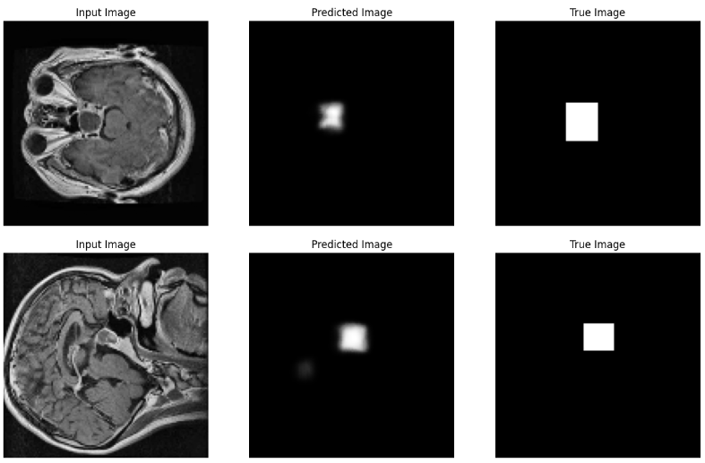

# U-Net MRI Semantic Segmentation

## Setup
1. Download dataset: https://www.kaggle.com/datasets/pkdarabi/brain-tumor-image-dataset-semantic-segmentation/data
2. Extract dataset to folder name `data` here.
3. Install Python requirements.txt:
```zsh
pip install -r requirements.txt
```

## Run
```zsh
python3 main.py
```

## Results


## References
- Model architecture: https://arxiv.org/pdf/1505.04597
- Dataset: https://www.kaggle.com/datasets/pkdarabi/brain-tumor-image-dataset-semantic-segmentation/data
